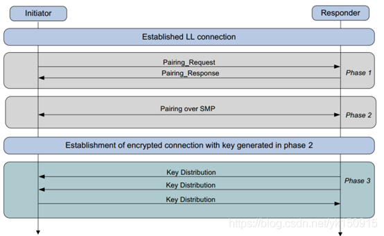
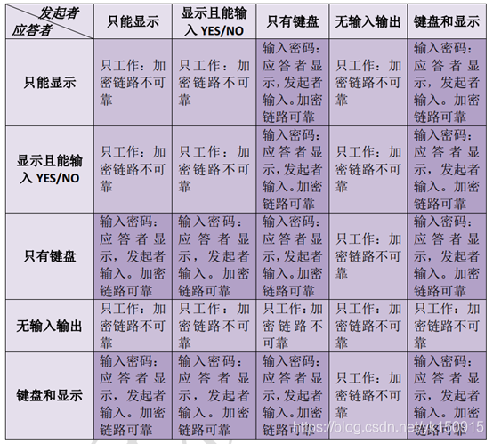
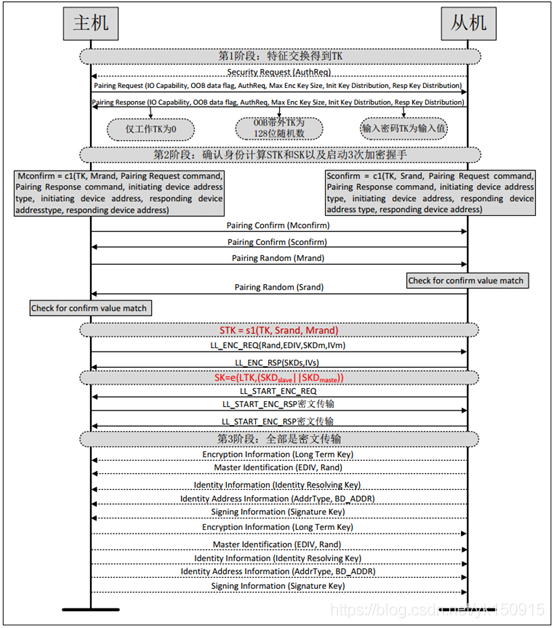

#SMP

##SMP 三个阶段

* 配对密钥特征交换
    - 鉴权信息
        - Just work TK 默认 000000
        - Numeric comparison 两个设备协商一个 6 位数据
        - passkey entry 输入数据
        - out of band 带外入网
    - IO 能力
    - legacy / secure

   
* key 产生
    * 如果是 legacy，计算产生 STK，短期密钥
    * 如果是 secure，计算产生 LTK，长期密钥
    * 计算生成 SK

* 密钥分发 
    * 分发密钥，比如 IRK，CSRK，等

IRK：ble 设备地址有两类，public address 和 random address，public address 需要申请，全球唯一，random address 又分为 static address 和 private address. private address 又分为可解析的和不可解析的，private address 会定时更新，可解析的地址，private resovlable address 是由随机数和 IRK 密钥计算生成的，所以只有拥有 IRK 的设备才能解析出地址。防止其他设备攻击。 

CSRK：数据签名是另一个能够帮助增加安全级别的BLE功能。在没有使用加密时，BLE可以使用连接签名解析密钥（CSRK，Connection Signature Resolving Key）对数据进行认证。签名是由签名算法和计数器产生的。计数器随各数据PDU递增，以避免任何重放攻击。注意，数据签名并非用来防护被动窃听，而是为接收设备验证数据源的真实性。

#完整过程

