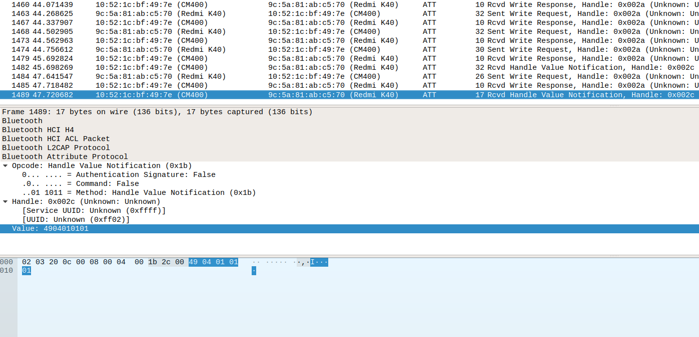
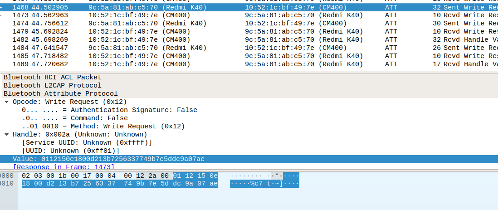

# <center>BluFi 抓包分析</center>

#帧格式

* Type (1 byte)   
* Frame Control (1 byte)
* Sequence Number (1 byte)
* Data Length (1 byte)
* Data 
* CheckSum (2 byte)

Type：最低两位来表示是 control frame 还是 data frame，高 6 位有具体对应

```shell
Frame Control：
- bit 0 是否加密       0 不加
- bit 1 是否有校验和    0 没有
- bit 2 数据方向       0 表示数据从手机到 esp
- bit 3 是否需要应答ACK
- bit 4 是否分包
```

#分析图片包状况

```shell
49 04 01 01 01

- 49：数据帧，高 6 位 010010，对应 report error
- 04：表示无校验和，数据从 esp 到手机
- 01：事务号
- 01：数据长度
- 01：数据，对应的错误为 0x01: checksum error

所以表示之前有包，校验和出现错误
```

```shell
01 12 15 0e 18 00 d2 13 b7 25 63 37 74 9b 7e 5d dc 9a 07 ae

- 01: 数据帧，高 6 位 000000 -> 发送协商数据
- 12: 0001 0010 bit2 = 1，bit 有校验和，bit4 = 1，有分包
- 15: 事务号
- 0e: 数据长度

- 07 ae: 校验和

发送协商数据，数据长度为 14，有分包
```
