# 
关于 ESP-IDF 问题反馈

&emsp;&emsp;目前统计了中文论坛所有关于环境搭建的问题，共 85 个问题。

&emsp;&emsp;在中文论坛里，目前合计约有 1590 个问题，由此可以得出环境搭建问题占比达到了 5.2% ，单这类问题就有 5% 的占比，可见环境搭建是阻碍继续使用 esp-idf 的拦路虎。集成开发环境本来是用来减少负担的，最后反而增加了开发者的负担，这是我们需要改进的。

# 一、中文图表数据

在中文论坛里，统计了使用三种搭建方式 (vscode, eclipse, else) 产生的问题数目和比例。else 包括了 linux 平台和 win 平台直接使用命令行搭建方式。

| else | vscode | eclipse |
|---   | ---    |   ---   |
|27    |41      |   17    |

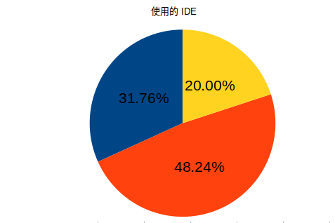

&emsp;&emsp;&emsp;&emsp;&emsp;&emsp;&emsp;&emsp;&emsp;&emsp;&emsp;&emsp;&emsp;&emsp;&emsp;&emsp;图表一

&emsp;&emsp;从图中可以看出，vscode 有41个相关问题，占据了接近 50% 的问题总量，其次是 else，最后是eclipse。 从中可以看出 vscode 是中国客户比较倾向使用的 IDE，同时也是问题最多的 IDE。

&emsp;&emsp;在中文论坛中，又统计了三类问题类型，大致分为安装类问题，编译类问题，使用类问题。使用类问题属于关于环境安装的各种杂项的问题合集。

| 安装  | 编译   | 使用     |
|---   | ---    |   ---   |
|34    |16      |   35    |

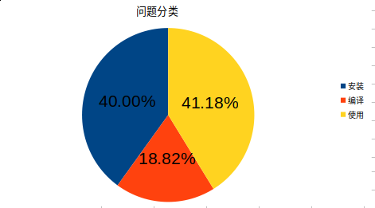

&emsp;&emsp;&emsp;&emsp;&emsp;&emsp;&emsp;&emsp;&emsp;&emsp;&emsp;&emsp;&emsp;&emsp;&emsp;&emsp;图表二

&emsp;&emsp;安装类问题有 34 个，占据 40% 的比例，可以看出安装类问题占据了主要问题类型，无法正确的安装环境，直接导致了开发受到阻碍。

&emsp;&emsp;下面图表进行了交叉统计，统计的是各平台在安装问题上所占比例

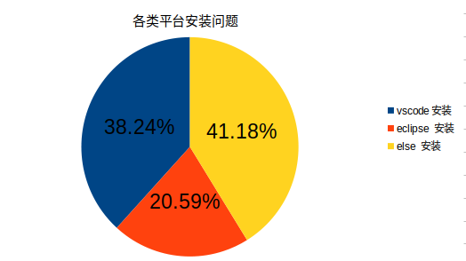    

&emsp;&emsp;&emsp;&emsp;&emsp;&emsp;&emsp;&emsp;&emsp;&emsp;&emsp;&emsp;&emsp;&emsp;&emsp;&emsp;图表三

&emsp;&emsp;从中可以看出 vscode 在安装问题上占据了 38.24% 的比例，vscode 在环境搭建上确实引起了最多的问题。直接在 win 或 linux 平台搭建环境也有相当高不成功的比例。

&emsp;&emsp;下面图表统计的是各平台在编译问题上所占比例
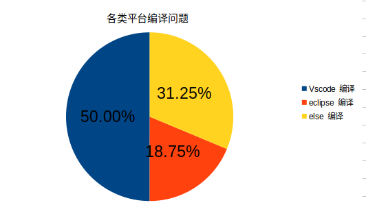    

&emsp;&emsp;&emsp;&emsp;&emsp;&emsp;&emsp;&emsp;&emsp;&emsp;&emsp;&emsp;&emsp;&emsp;&emsp;&emsp;图表四

&emsp;&emsp;vscode 的编译问题占据了一半的比例，安装好后，却编译不成功，这也直接影响了开发者使用软件的热情。

# 二、英文图表数据

&emsp;&emsp;以下为英文论坛数据，英文论坛共有 7629 个问题， 环境问题合计约有 370，问题占比 4.8% 和中文论坛占比差不多

| else | vscode | eclipse |
|---   | ---    |   ---   |
|193   |76      |   102    |

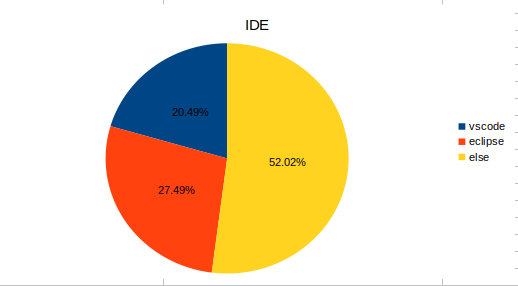 

&emsp;&emsp;&emsp;&emsp;&emsp;&emsp;&emsp;&emsp;&emsp;&emsp;&emsp;&emsp;&emsp;&emsp;&emsp;&emsp;图表五

&emsp;&emsp;三类平台，占主要比例的是依靠 win 和 linux 平台搭建环境的方式与中文论坛不同。

| 安装  | 编译   | 使用     |
|---   | ---    |   ---   |
|90    |139     |   141    |

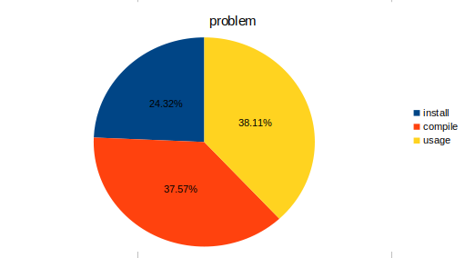 

&emsp;&emsp;&emsp;&emsp;&emsp;&emsp;&emsp;&emsp;&emsp;&emsp;&emsp;&emsp;&emsp;&emsp;&emsp;&emsp;图表六

三类问题，占主要比例的是编译问题，对于 example 的编译存在较大难度

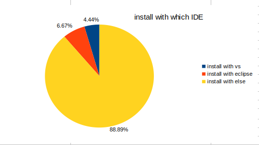 

&emsp;&emsp;&emsp;&emsp;&emsp;&emsp;&emsp;&emsp;&emsp;&emsp;&emsp;&emsp;&emsp;&emsp;&emsp;&emsp;图表七

&emsp;&emsp;由此可以看出在非 vscode 和 eclipse 上安装问题占据了接近 90% 比例

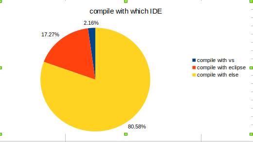 

&emsp;&emsp;&emsp;&emsp;&emsp;&emsp;&emsp;&emsp;&emsp;&emsp;&emsp;&emsp;&emsp;&emsp;&emsp;&emsp;图表八

&emsp;&emsp;由此可以看出在非 vscode 和 eclipse 上编译问题占据了接近 80% 比例

&emsp;&emsp;从上面的图表可以看出，外国客户显然更习惯直接用非 IDE 方式去搭建平台，并且在这上产生了大量的问题，与中国客户习惯相反

# 三、建议
&emsp;&emsp;进行统计以后，又对该类中文问题的回复率进行了大概的观察。

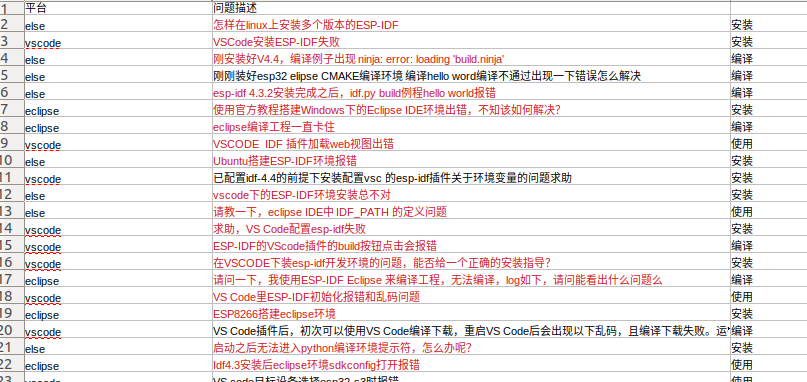 

&emsp;&emsp;&emsp;&emsp;&emsp;&emsp;&emsp;&emsp;&emsp;&emsp;&emsp;&emsp;&emsp;&emsp;&emsp;&emsp;图1

&emsp;&emsp;标记为红色的，则意味着没有回复或者没有解决。6 个月内，共计 21 个关于环境搭建问题，其中未解决的有 18 个，未解决率高达 85.7%

&emsp;&emsp;可以看出几乎没有人去解决环境搭建问题。一部分是因为人员比较繁忙没有时间回复，另一方面也由于环境搭建问题本身的复杂度非常高，引起的问题多种多样无法一概而论，必须具体问题具体分析。

&emsp;&emsp;综合上述各类问题，目前可以提出的建议有：

1. 分配人员处理问题
2. vscode 在各方面问题都占据了非常高的比例，短期内，可以考虑把重心先放在 vscode上，优先解决 vscode 相关问题，并将问题进行整理
3. 考虑开发一些脚本工具来辅助检查环境问题
4. 长期应该考虑开发一个自己的 IDE，不再依赖 vscode 或者 eclipse，将环境问题彻底减少
5. 环境安装失败常见问题之文档优化建议：
    * windows 上使用安装工具一键安装，要求 64 bit 的 PC 版本，不支持 32 bit  的PC 环境，是因为因为 cmake 和 ninja 缺少 32位版本。这个在 esp-idf 安装指南里没有说明，是否可建议更新文档以增加对应说明？
    * windows 上使用安装工具一键安装，很多人会使用在线安装包，这要求网络环境支持访问 github ，但很多客户没有这个网络环境要求，导致安装失败。所以安装过程需要勾选镜像到 gitee 上才可以成功。这个在 esp-idf 安装指南里没有说明，是否可建议更新文档以增加对应说明？
6. 其他建议：
    * windows 上由于一些安全防护、杀毒类软件会自动屏蔽和删除一些 esp-idf 组件的安装，所以安装过程一般要求客户关闭这些安全防护类软件。
    * 国内客户使用 Ubuntu 的 PC 环境通过指令来安装 esp-idf SDK 的编译环境时，也需要有网络环境的支持。
    * 官方一般使用的是 Ubuntu 18.04 版本，有些客户会使用 Ubuntu 16 或 Ubuntu 20 版本，然后按照官方的指南步骤运行也会有问题，这个上面是否有什么建议？
    * 客户基于 Ubuntu 安装 esp-idf SDK 的编译环境，一般会遇到 pyhton 版本问题，且不同版本的 esp-idf SDK  要求不同版本的 python 环境，遇到 Pyhton 问题应该如何指导客户解决。
    * VScode 的 Espressif 编译环境一般会有客户出现升级 esp-idf sdk 版本后，编译出问题，很多是因为工具链、组件没有更新等。
7. 从 TS 支持角度上的建议：
    * Windows 上当客户使用 VScode 的 Espressif 或 Eclipse 的编译环境时出错时，优先推荐客户使用官方一键安装工具来搭建环境。很多客户之所以选择VScode 的 Espressif 或 Eclipse 的编译环境是因为不清楚使用 esp-idf CMD 编译环境时，如果进行代码编辑和查看调试日志，从长远支持角度和软件维护便利性来看，建议与客户明确使用 esp-idf CMD + Vscode 环境配合使用，esp-idf CMD 仅作为工程编译，而Vscode 环境仅作为代码编辑。一般与客户讲清楚 esp-idf CMD + Vscode 环境搭配使用的便利性之后，客户是愿意接受此推荐的。
      - 优点如下：
        - 便于版本维护、更新和管理（组件、bug、特定的分支）
        - 便于不同芯片型号的切换 （set-target）
        - 新产品的适配等
        - 与其他 SDK 的环境的关系，比如 MDF、ADF、BOX 等。
        一般会给客户发几张图片参考，如下：
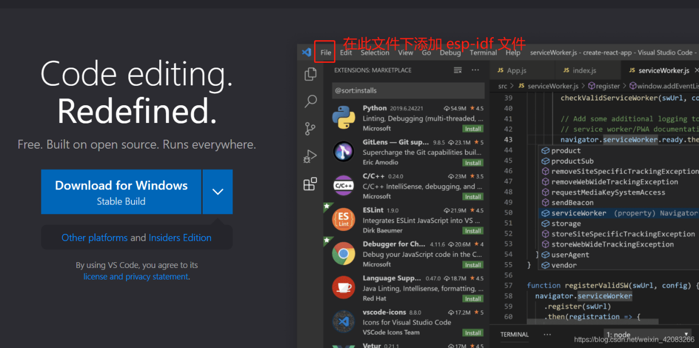 

&emsp;&emsp;&emsp;&emsp;&emsp;&emsp;&emsp;&emsp;&emsp;&emsp;&emsp;&emsp;&emsp;&emsp;&emsp;&emsp;图2

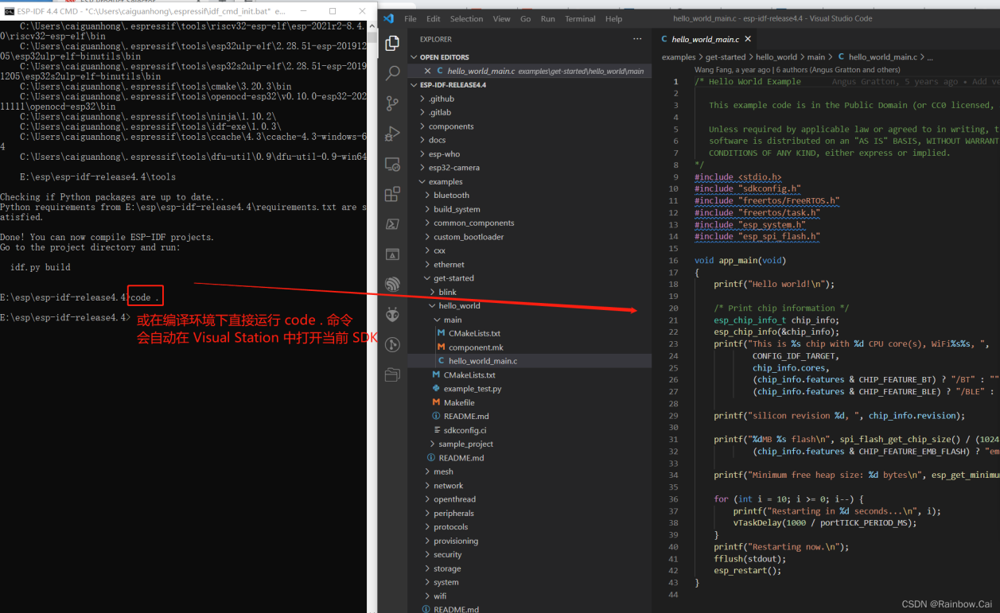 

&emsp;&emsp;&emsp;&emsp;&emsp;&emsp;&emsp;&emsp;&emsp;&emsp;&emsp;&emsp;&emsp;&emsp;&emsp;&emsp;图3

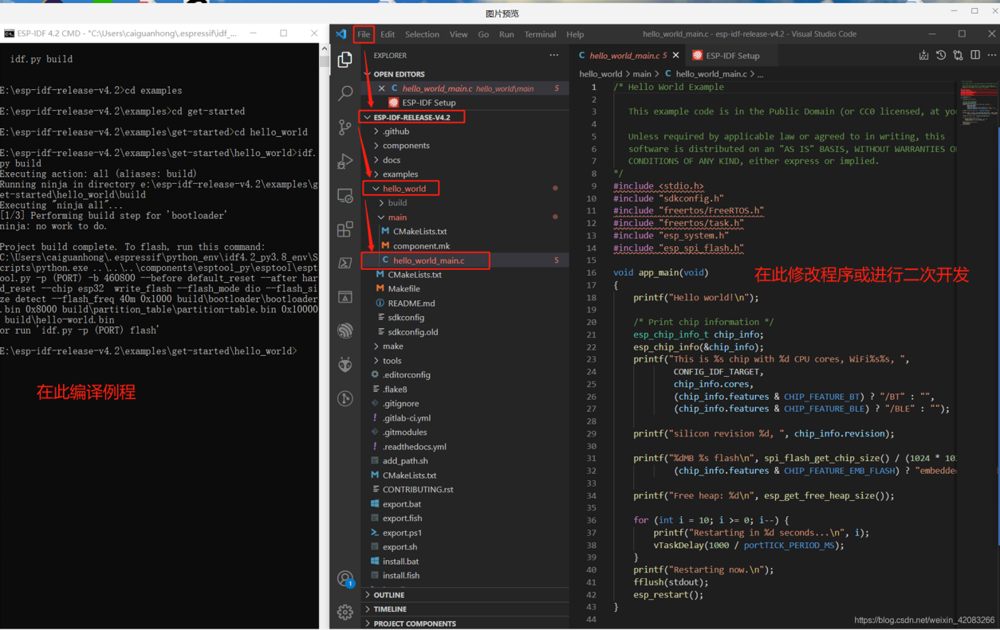 

&emsp;&emsp;&emsp;&emsp;&emsp;&emsp;&emsp;&emsp;&emsp;&emsp;&emsp;&emsp;&emsp;&emsp;&emsp;&emsp;图4

