#服务发现过程

服务发现过程大致分为，发现服务 -> 发现特征 -> 发现描述符，每个服务执行一次

蓝牙 profile 结构
* Profile
    * Primary service
        * characteristic
            * desscriptor
    * Primary service
        * characteristic
            * desscriptor

下面对一个 log 分析服务发现全过程

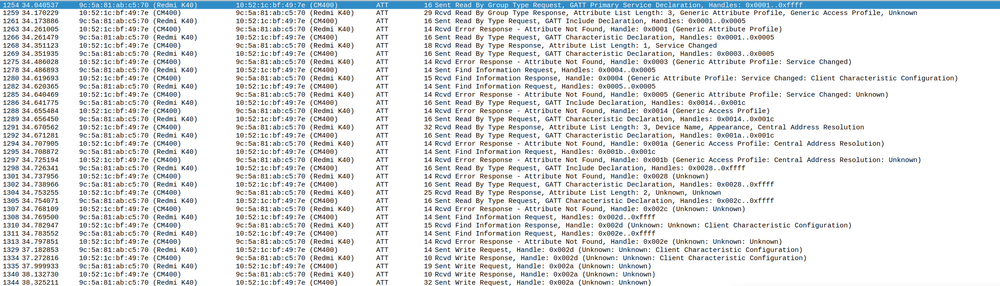

--------------------------------------------------------------
-------------------------------------------------------------

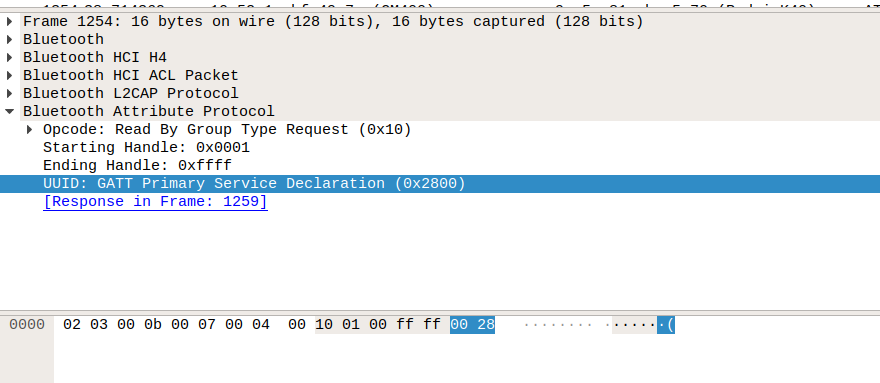

1254: 发送请求，寻找 GATT 主服务声明，范围从 0x01 ~ 0xffff

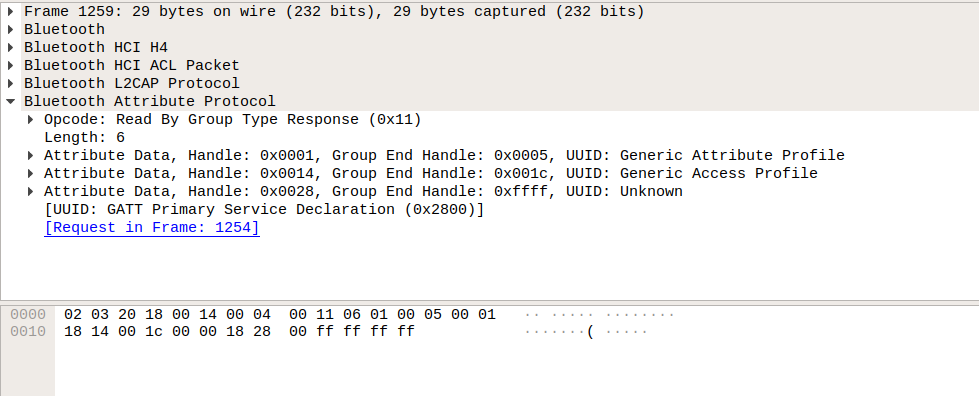

1259: 回复主服务，显示句柄范围

    0x1 ～ 0x5 Generic Attribute Profile 

    0x14 ~ 0x1c Generic Access Profile 

    0x28 ~ 0xffff 自定义服务

以后过程就是分三次，分别枚举 Generic Attribute Profile 和 Generic Access Profile 和自定义服务的特征描述符

```shell
Read By Type Request 特征请求

Find Information Request 描述符请求
```

| Line          | 过程                             |
|---            | ---                              | 
|1261 ～ 1285	| Generic Attribute Profile 发现过程|
|1286 ～ 1297	| Generic Access Profile 发现过程	|
|1298 ～ 1313	| 自定义服务 发现过程                 |

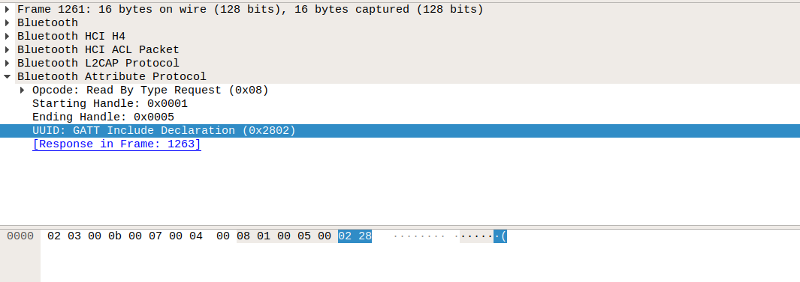

1261: 发送询问是否有 Include 服务

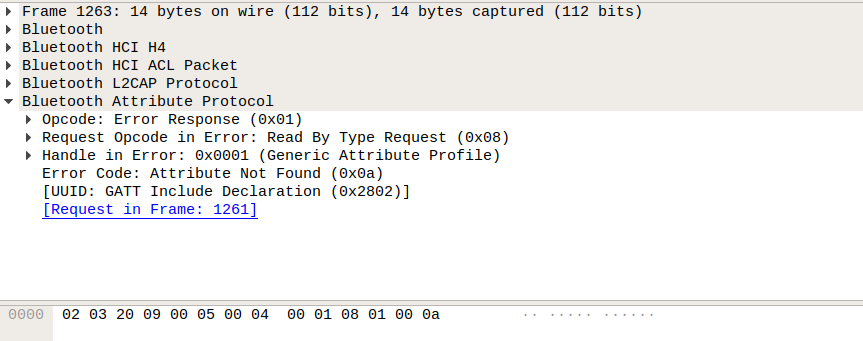

1263： 回复没有 Include

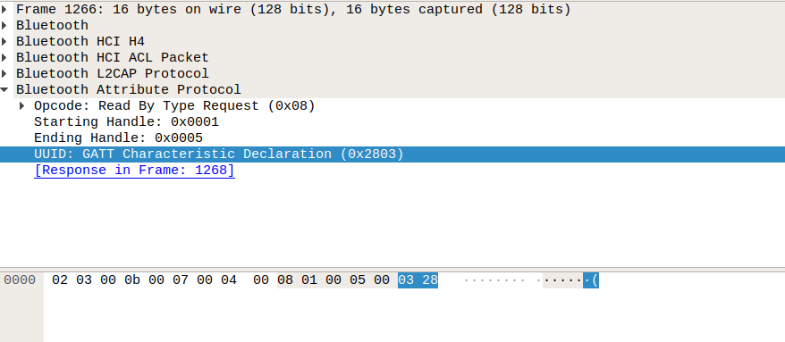

1266：Read By Type Request，在 1 ～ 5 范围寻找 GATT 的特征声明

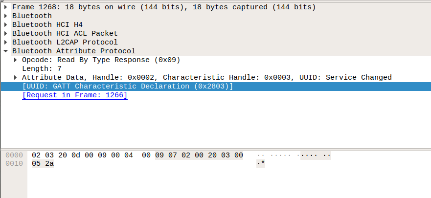

1268： 找到特征声明，句柄为 0x2，服务的特征句柄为 -> 0x03

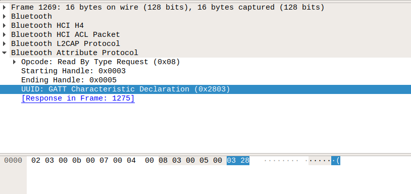

1269：继续请求该服务下的其他特征，开始句柄 3，结束句柄 5

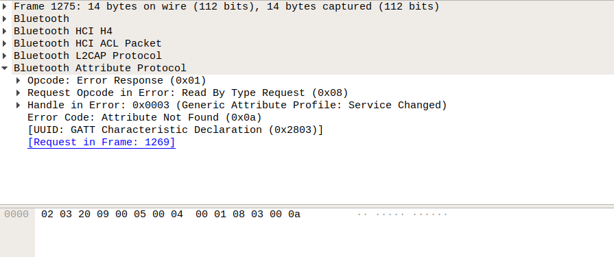

1275：回复没有其他特征

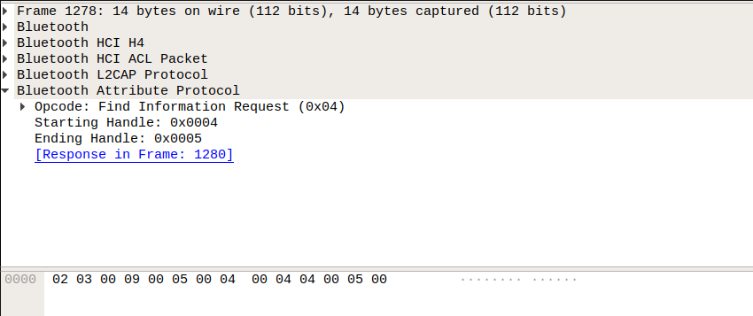

1278：Find Information Request，请求描述符，开始句柄 4，结束 5  (3 是特征句柄) 

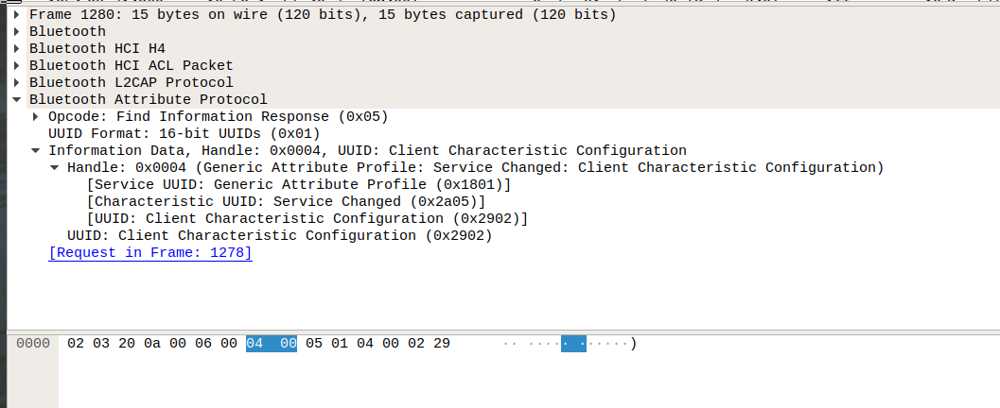

1280：应答描述符,cccd 用来使能或者禁用 notify/indicate


